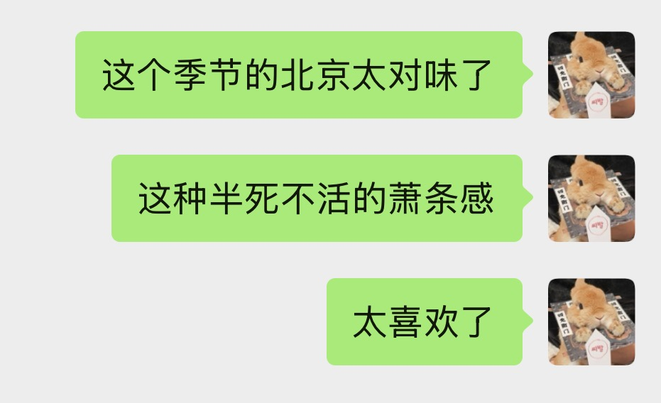

  
翻到博客才发现一年没发东西了，其实并不是没有写，可能是因为生活已经被另一个学科的写作完全占据，再加上生活本来就很无聊，导致随笔完全没有兴致写。

今天读完2024年7月写的离京小记，感慨倒也是很多。或许我在过去一年的变化比本科四年还要大。我的写作风格逐渐从光怪陆离变成了一种对自己恳切的风格。倒不是说那些奇妙的联想与思绪流不存在了，而是即使这些写作风格还存在，也是对我自己来说非常真诚的。以前的我会为了修饰辞藻，将幻想进行不必要的扩大化；而现在的我觉得将自己的想法如实记录就好。

可能是因为写作对我来说意义变了。过去我用写作表达自己的内心世界，并不完全是为了捕捉与记录，还有一部分私心在于将内心世界展露给其他人看，这样哪怕能够获得一点点共鸣也是莫大的幸福。因此我把内心世界的显化附着在大量的同人故事上，用纸片人的故事讲述我自己内心的故事。如今，与他人分享内心世界好像已经没有必要，写作变成了我确认自己还活着以及目前是什么状态的一种手段。硬要说的话就是从小说变成了纪实文学的感觉。

说得有点远了。既然一年因为生活太无聊而没有写随笔，那为什么今天又写了呢？因为我上周末去了一趟北京。仔细想想这应该是我继2024年7月离湖之后第二次回到北京。上一次是在今年的五一，但当时只匆匆经过，看了一场live，吃了一顿饭，打了一局麻将，然后就离开了。虽然也见到了一些想见到的人，但终究没有见到最想见到的人。那一次北京之行现在来看已经印象非常浅了。

如今，我在最适合拜访北京的秋季又来到北京了。不过这次的目的更苦涩，是为了考高校的图书馆岗位，并且周末两天各有一场考试。是的，离京之后我一直在思考怎么才能回到北京。我觉得这个城市是教会我怎么好好生活的一个地方，是我朋友最多的城市，同时也是害我混淆爱与恨的地方。我一直对北京有很复杂而扭曲的感情，爱恨交加，这地方越让我感觉痛苦我就越无法离开。不过这不是这篇随笔的重点。想详细了解的请看上一篇吧。总而言之，我回到北京了。到达大兴机场已经是凌晨12点，在叫车去民宿的路上，高速两侧全是黑黢黢的树和什么都没有的空田。于是我就想起来某一天晚上从后沙峪坐公交回怀柔，结果错过了快车，只能坐慢车在村子里慢悠悠地晃回怀柔市区。那天车窗外也是这样的景象，京郊农村晚上总是没有灯，特别阴暗，秋天的树又没什么叶子，一切都很苍白。于是我当时就给朋友发了这个消息：

是的，就跟我的精神状态一样病怏怏的，黑黑的，什么也看不见。（题外话：我喜欢这种昏暗的郊外可能是因为我的视力越来越差了，而在黑暗中不需要担心看不见的问题。）

然后我想起来2023年2月发的那篇随笔《我又一次乘车在北京冬天的高速路上》。这也是这篇随笔题目的由来。突然间一切在北京的记忆都变得鲜活起来。

我挂壁在lyt的宿舍里。上一次这么干好像还是看拉克美的那天晚上？不太记得了。总之，见面的时候我以为我会很激动，结果我们俩都意外地平静，可能是因为我有点不太知道该怎么表达这种特别的快乐。然后我又走进了图书馆自习，背一些文献学、信息组织、信息计量、图书编目之类的东西。上一次我在北航图书馆自习也是学一样的内容，那是2022年9月，我保研之前的事了。一切都仿佛回到了那个时候……吗？我现在对图书馆的了解应该更深了一些吧。

第一天考完试之后去花园北路麦当劳吃了一顿，这下稍微有点回家的感觉了。花园北路麦当劳对我来说是一个承载了特殊回忆的地方，是合唱团小团体团建的地方，我们一群人一起发疯的地方，排练完后固定聚集的地方。即使只是坐在这里也能回想起那阵子的一些记忆片段。

12公寓我虽然只住过一两个月，但我还能在盥洗室找到我23年用过的牙具和洗面奶，真神奇，就好像我还一直住在这里一样。我很喜欢12公寓的公共卫浴设施，这比独立卫浴还要好，可能是因为不需要自己打扫，宿舍里很干净。

第二天考完试之后先是和国科大同学吃萨莉亚。虽然大部分都是群友关系但是也有一起组过乐队、跑过现地之类比较熟悉的朋友。其实我还挺喜欢跟他们在一起鬼混的，跟这些人交际确实是比较轻松，还可以释放人格的阴暗面……之后去机厅玩音击，和ob他们团建，稍微聊起了以后工作的事，也没什么结论地收场了。上面的这一切结束之后我又回到了西土城麦，心血来潮把合唱团小团体19级的其他三位叫了出来。于是我们四个又聚在一起了，就像大四的时候一样。跟他们在一起感觉什么都可以说什么都可以聊，无论多抽象的neta都能接上，无论多刁钻的笑点都能get到，因为跟他们待在一起本身就足够快乐。我们聊了点学术聊了点生活又花了一个多小时研究怎么在没有瓶起子的情况下打开啤酒盖。我好久没有笑得这么开心过了，笑得眼泪都在流。走在立交桥上回学校的这个晚上好像跟之前每一个排练结束后加餐吃夜宵的晚上没有区别。但是我们永远都回不到那段随随便便就能把人喊齐出来吃麦或者喝酒或者压马路的日子了。他们是我最好的朋友。

去大兴机场的路上，我不知道为什么很困，睡着了。我已经没有精力再去想窗外的景色背后有什么隐喻。总之我又回到成都了。

在上一篇随笔里我悲观地预测自己再也不会回到北京，再也不会和Sev见面，但是一年过去，我们见了好几次，我也去了几次北京。逐渐地生活中的一切似乎都变得越来越可控。可能悲观是一种错误，但我确实对未来的生活有了一些信心。也许就是对生活本身的向往还在支撑我好好活着吧……
